#  springcloud-alibaba

## 官网地址：

- springcloud springcloudalibaba springboot版本对应关系地址：[https://github.com/alibaba/spring-cloud-alibaba/wiki/%E7%89%88%E6%9C%AC%E8%AF%B4%E6%98%8E](https://github.com/alibaba/spring-cloud-alibaba/wiki/%E7%89%88%E6%9C%AC%E8%AF%B4%E6%98%8E)![image-20201127134044039]
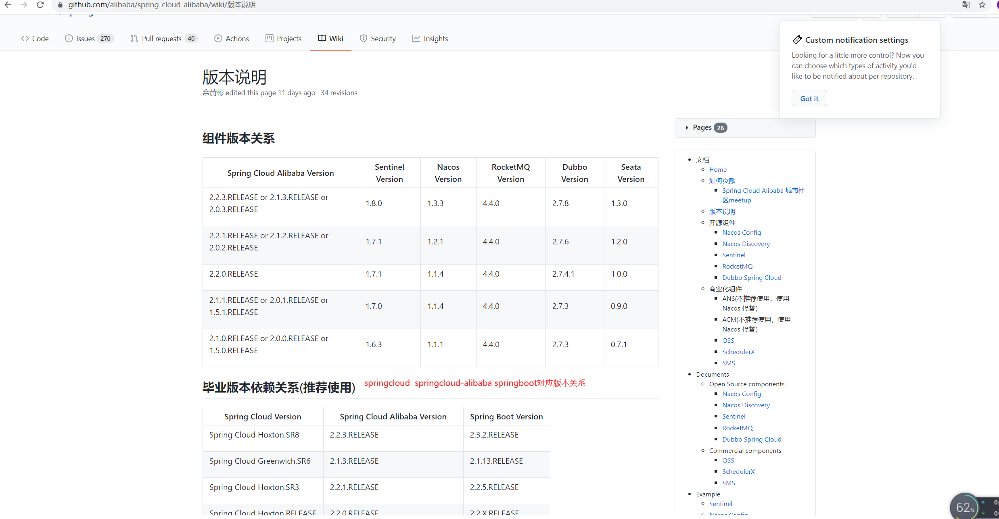


## springcloud-alibaba 和springcloud


|      功能      | springcloud(netfilix) | springcloud-alibaba | dubbo |
| :------------: | :-------------------: | :-----------------: | :---: |
| 服务注册、发现 |   eureka(18年停更)    |        nacos        |       |
|    负载均衡    |     ribbon、fegin     |       ribbon        |       |
|   熔断、降级   |        hystrix        |      Sentinel       |       |
|      路由      |         zuul          |       getway        |       |
|    链路追踪    |                       |       Sleuth        |       |
|   分布式事务   |                       |        seata        |       |
| 分布式配置中心 |   SpringCloudConfig   |        nacos        |       |


## 一、服务注册、发现 nacos

- nacos中文文档:[https://nacos.io/zh-cn/docs/quick-start.html](https://nacos.io/zh-cn/docs/quick-start.html)

- nacos服务端的安装方式有两种，1.下载源码自己编译、安装 2.下载编译好的源码

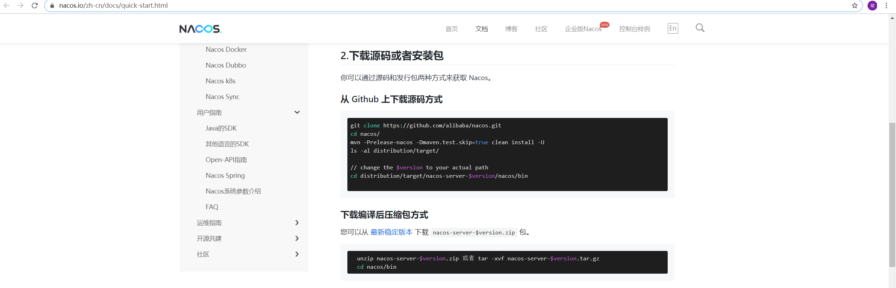

- 下载编译好的源码,下载地址:[https://github.com/alibaba/nacos/releases](https://github.com/alibaba/nacos/releases)

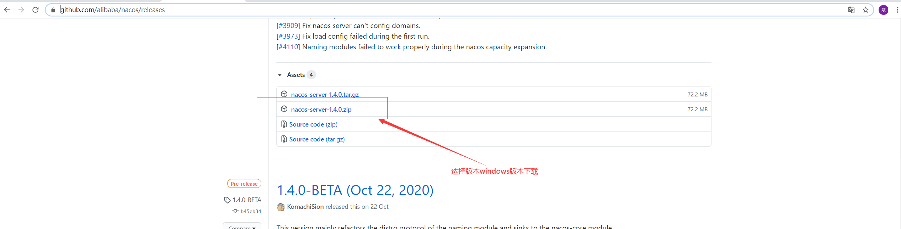

- 下载完毕，解压到相应的目录

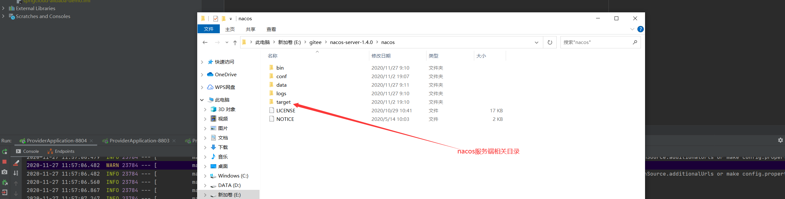


## 启动nacos服务端

- 进入到nacos的bin目录下

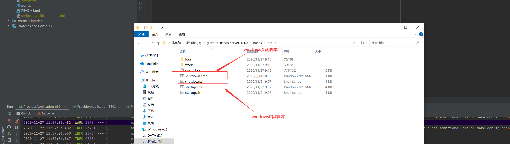

- 启动单机nacos服务`startup.cmd -m standalone`

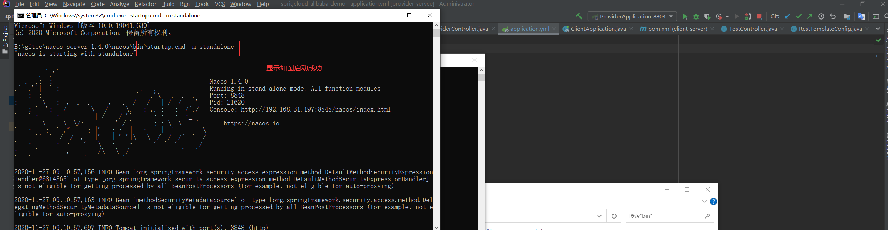

- 启动完毕验证服务`localhost:8848/nacos`  默认账号密码都是nacos

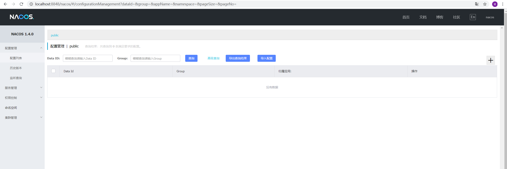


## 应用注册到nacos中

1. 添加依赖

```xml
           <dependency>
               <groupId>com.alibaba.cloud</groupId>
               <artifactId>spring-cloud-starter-alibaba-nacos-discovery</artifactId>
           </dependency>
```
2. 配置 在启动类上添加@EnableDiscoverClient

```java
/**
 * @author liouwb
 */
@SpringBootApplication
@EnableDiscoveryClient
public class ProviderApplication {
    public static void main(String[] args) {
        SpringApplication.run(ProviderApplication.class, args);
    }
}
```
3. application.yml配置

```yaml
   server:
     port: 8804 # 端口号
   
   spring:
     application:
       name: provider-server # 显示在nacos的服务名称
   
     cloud:
       nacos:
         discovery:
           server-addr: localhost:8848  # nacos地址
```
4. 启动服务就会注册到nacos

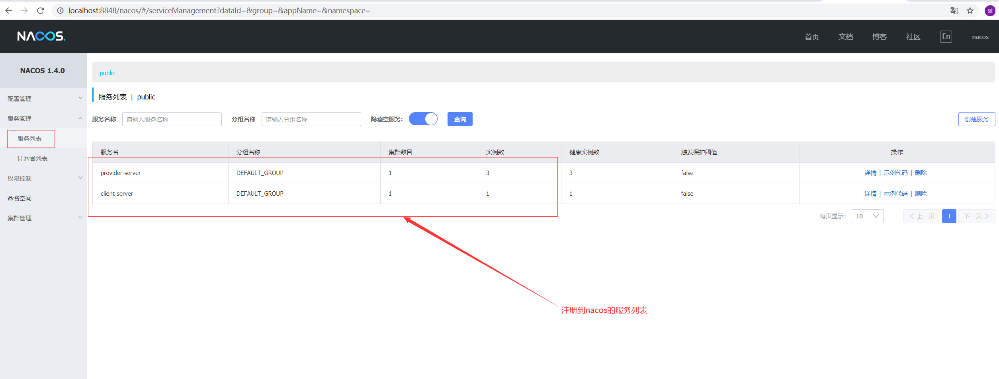


## 负载均衡 ribbon

- 无需引用jar，nacos依赖的有ribbon

  1. 配置ribbon负载均衡的策略

 ```java
     /**
      * @author liouwb
      */
     @Configuration
     public class RibbonRuleConfig {
     
         /**
          * 自定义负载均衡算法
          * ribbon负载均衡配置类IRule
          * RoundRobinRule 默认的 轮询
          * RandomRule随机
          * WeightedResponseTimeRule 权重
          */
         @Bean
         public IRule myRule() {
             return new RandomRule();
         }
     }
 ```

  2. 配置restTemplate

```java
     /**
      * @author liouwb
      */
     @Configuration
     public class RestTemplateConfig {
     
         @Bean
         public RestTemplate restTemplate() {
     
             return new RestTemplate();
         }
     }
```

3. webclient配置

```java
   /**
    * @author liouwb
    */
   @Configuration
   public class WebClientConfig {
   
       @Bean
       @LoadBalanced
       public WebClient.Builder webClientBuilder() {
   
           return WebClient.builder();
       }
   }
```

4. 通过client-server 调用provider-server

```java
/**
 * 调用provider服务 restTemplate
 *
 * @return
 */
@GetMapping(value = "restProvider")
public String restProvider() {
    //Access through the combination of LoadBalanceClient and RestTemplate
    // 发现服务
    ServiceInstance serviceInstance = loadBalancerClient.choose("provider-server");
    // 格式化请求路径
    String path = String.format("http://%s:%s/provider/get", serviceInstance.getHost(), serviceInstance.getPort());

    System.out.println("请求路径：" + path);

    return restTemplate.getForObject(path, String.class);
}


/**
 * 调用provider服务 webClientProvider
 *
 * @return
 */
@GetMapping(value = "webClientProvider")
public String webClientProvider() {

    return clientBuilder
            .baseUrl("http://provider-server/provider/get")
            .build()
            .method(HttpMethod.GET)
            .retrieve()//请求结果的方法
            .bodyToMono(String.class)
            .block();
}
```

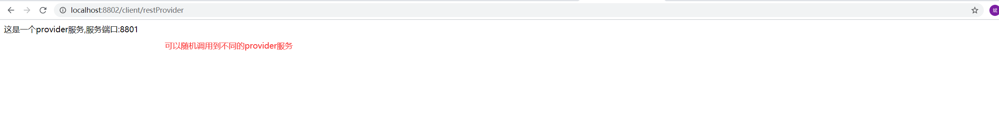

## 熔断、降级 Sentinel

- 文档地址:[https://github.com/alibaba/Sentinel/wiki/%E4%BB%8B%E7%BB%8D](https://github.com/alibaba/Sentinel/wiki/%E4%BB%8B%E7%BB%8D)

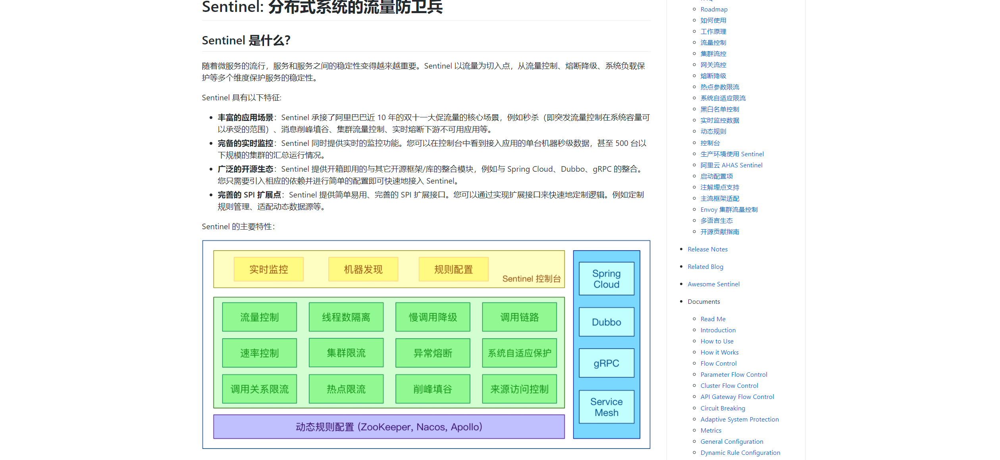

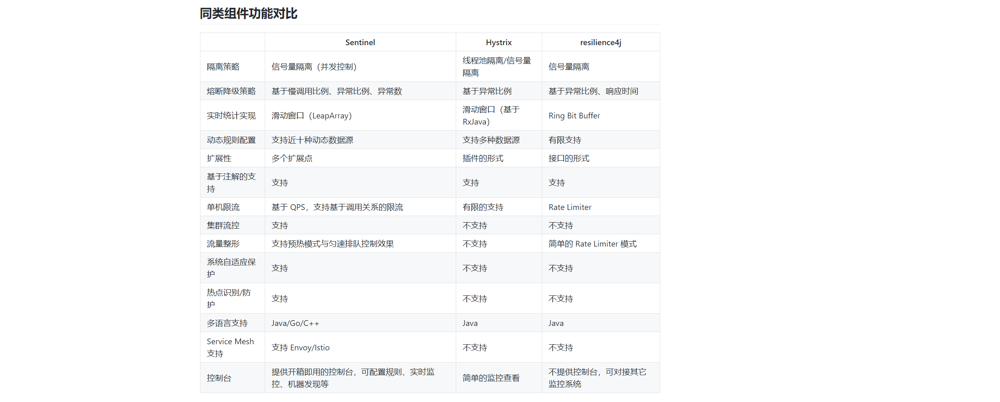

#### sentinel服务端安装和启动

- sentinel服务端的下载地址：[https://github.com/alibaba/Sentinel/releases](https://github.com/alibaba/Sentinel/releases)

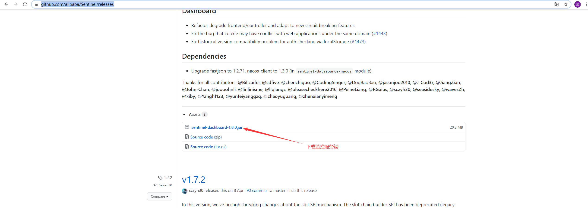

- 下载完毕之后，到sentinel目录下启动sentinel`

```shell
java -Dserver.port=8805 -Dcsp.sentinel.dashboard.server=localhost:8080 -Dproject.name=sentinel-dashboard -jar sentinel-dashboard-1.8.0.jar
```

- -Dserver.port=8805是sentinel服务端访问的端口

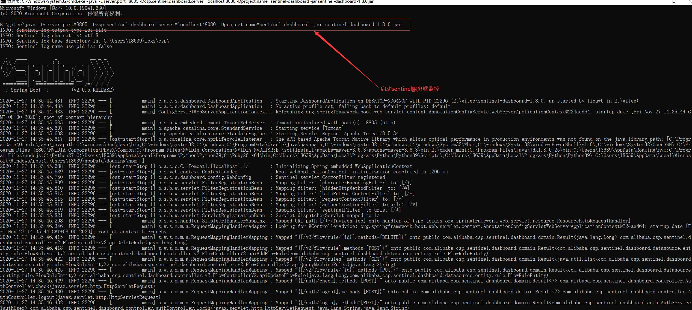

- 启动之后sentinel 登录界面`localhost:8805` 默认的用户名和密码都是sentinel

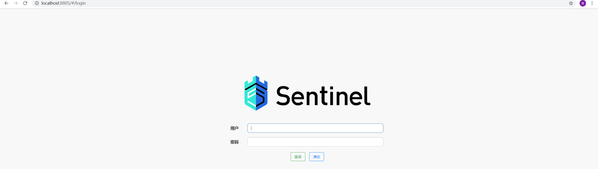

- 登录之后

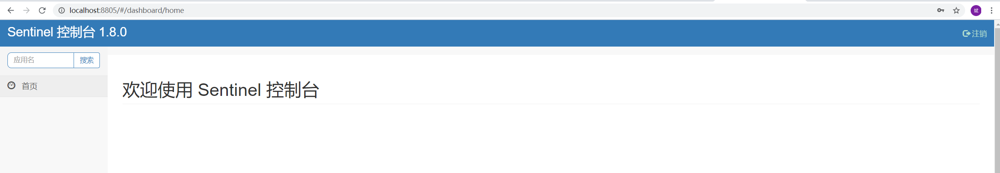

#### provider应用服务集成sentinel

1. 添加依赖

```xml
<dependency>
    <groupId>com.alibaba.cloud</groupId>
    <artifactId>spring-cloud-starter-alibaba-sentinel</artifactId>
</dependency>
```

2. 配置application.yml

```yaml
   cloud:
     nacos:
       discovery:
         server-addr: localhost:8848
     sentinel:
       transport:
         dashboard: localhost:8805
```

3. 在接口上使用@SentinelResourc    value 原方法 blockHandler  异常处理 fallback 降级处理

```java
    @GetMapping(value = "get")
    @SentinelResource(value = "get", blockHandler = "exceptionHandler", fallback = "fallbackFun")// value 原方法 blockHandler  异常处理 fallback 降级处理
    public String get() {

        return "这是一个provider服务,服务端口:" + serverPort;
    }

    public String fallbackFun() {

        return "@sentinel:" + serverPort;
    }

    public String exceptionHandler(){

        return "@sentinel exceptionHandler:" + serverPort;
    }
```

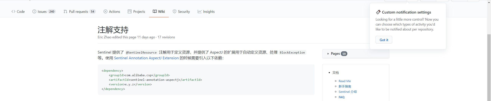

- @SentinelResource` 注解用来标识资源是否被限流、降级

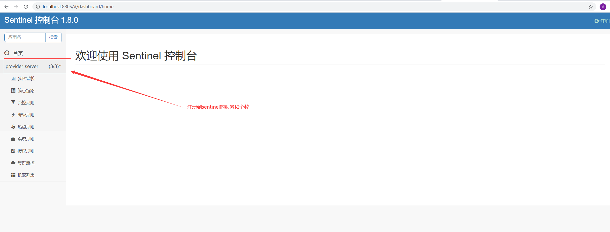

- 限流设置

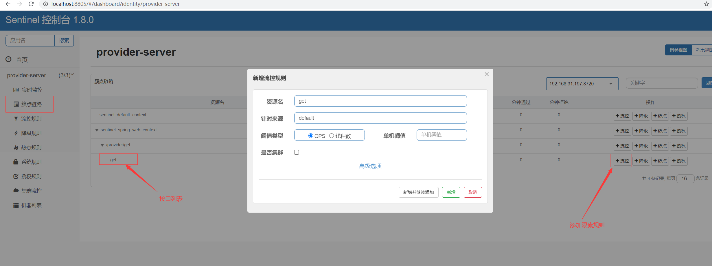

- 添加

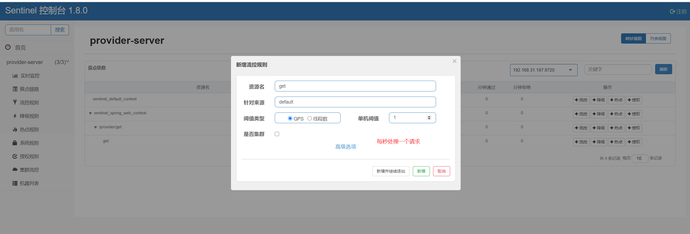

- 添加完限流规则就会出现在流控规则列表

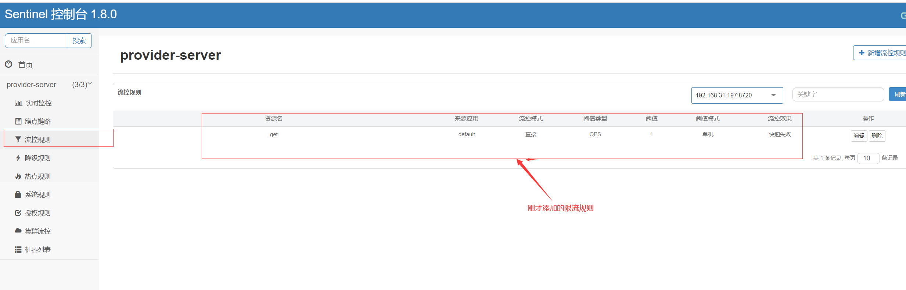

- 然后在快速访问接口

  

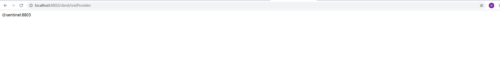

- 实时监控流量

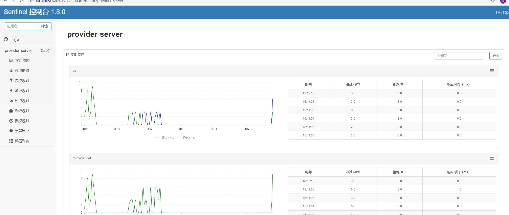

